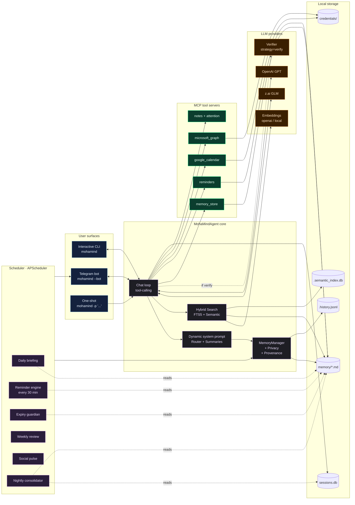

```
███╗   ███╗ ██████╗ ██╗  ██╗ █████╗ ███╗   ███╗██╗███╗   ██╗██████╗         ▄▄███▄  ▄███▄▄
████╗ ████║██╔═══██╗██║  ██║██╔══██╗████╗ ████║██║████╗  ██║██╔══██╗      ▄██╭╮╭╮██  ██╭╮╭╮██▄
██╔████╔██║██║   ██║███████║███████║██╔████╔██║██║██╔██╗ ██║██║  ██║     ██▌╰╯╭╯██▌▐██╰╮╰╯▐██
██║╚██╔╝██║██║   ██║██╔══██║██╔══██║██║╚██╔╝██║██║██║╚██╗██║██║  ██║     ██▌╭╮╰╮██▌▐██╭╯╭╮▐██
██║ ╚═╝ ██║╚██████╔╝██║  ██║██║  ██║██║ ╚═╝ ██║██║██║ ╚████║██████╔╝      ▀██╰╯╰╯██▌▐██╰╯╰╯██▀
╚═╝     ╚═╝ ╚═════╝ ╚═╝  ╚═╝╚═╝  ╚═╝╚═╝     ╚═╝╚═╝╚═╝  ╚═══╝╚═════╝         ▀▀██▄▄▐▌▄▄██▀▀

Your Personal Agent · Always On · Always Remembering
```

[](https://www.python.org/downloads/)
[](LICENSE)

MohaMind is a CLI-first personal AI agent built for real life operations — reminders, tasks, family events, bills, documents, health, vehicle, and follow-up. Speaks Arabic and English. Lives in the terminal. Reaches you on Telegram.

**Built for people who want:**

- A terminal-first workflow with slash commands and autocomplete
- Readable Markdown memory files — not opaque databases
- Reliable reminders scheduled in KSA time (Asia/Riyadh)
- Arabic and English conversation, including Gulf/Saudi dialect
- Telegram access alongside the local CLI
- Proactive daily briefings, weekly reviews, and expiry alerts

MohaMind uses z.ai (GLM) by default and can use OpenAI as:

- a silent **fallback** (only called when z.ai fails),
- a **verifier** that double-checks every z.ai answer, or
- nothing at all (**solo** mode).

You pick the mode during `mohamind setup` and can change it later.

## Contents

- [What It Does](#what-it-does)
- [Core Capabilities](#core-capabilities)
- [Quick Start](#quick-start)
- [Run Modes](#run-modes)
- [First 5 Minutes](#first-5-minutes)
- [Common Real-Life Flows](#common-real-life-flows)
- [How The Agent Thinks About Your Data](#how-the-agent-thinks-about-your-data)
- [Arabic And Dialect Support](#arabic-and-dialect-support)
- [Reliability Notes](#reliability-notes)
- [Core CLI Commands](#core-cli-commands)
- [Telegram Usage](#telegram-usage)
- [Scheduler And Proactive Behavior](#scheduler-and-proactive-behavior)
- [Memory Model](#memory-model)
- [Advanced Memory Features](#advanced-memory-features)
- [Memory Architecture](#memory-architecture)
- [Integrations](#integrations)
- [Minimal Configuration](#minimal-configuration)
- [System Architecture](#system-architecture)
- [Repository Layout](#repository-layout)
- [Troubleshooting](#troubleshooting)
- [Quality](#quality)
- [Development](#development)
- [License](#license)

## What It Does

MohaMind combines four layers into one personal agent:

- `Conversation`: interactive CLI and Telegram chat
- `Structured memory`: persistent Markdown files under `memory/`
- `Session recall`: persistent conversation history in `memory/sessions.db`
- `Proactive jobs`: scheduled checks for reminders, expiries, briefings, and reviews

In practice, that means you can talk to it normally, let it store what matters, and ask it later what is due, what is expiring, or what was discussed before.

## Core Capabilities

- Natural-language reminders with exact KSA scheduling
- Task tracking with priority and due dates
- Occasion tracking for birthdays, anniversaries, and recurring annual dates
- Finance tracking for bills and subscriptions
- Vehicle, health, family, and document tracking
- Persistent conversation recall across restarts
- Attention radar for prioritizing what matters now
- Daily briefing and weekly review
- Arabic and English responses
- Colloquial Arabic understanding, including phrases like:
  - `بكره`
  - `بعد بكره`
  - `٤ العصر`
  - `٥ الصبح`
  - `يوم نعم ويوم لا`

## Quick Start

### Requirements

- Python 3.12+
- [uv](https://docs.astral.sh/uv/)
- one API key:
  - [z.ai](https://z.ai)
  - [OpenAI](https://platform.openai.com/)

You do not need Telegram, Google Calendar, or Outlook to get started.

### Install

```bash
git clone https://github.com/MohamedMohana/MohaMind.git
cd MohaMind
uv sync
```

### Configure

```bash
uv run mohamind setup
```

The setup wizard writes `.env` and asks for:

- your LLM provider + API key
- verifier / fallback / solo strategy
- your timezone and morning briefing time
- optional Telegram settings
- optional Google Calendar / Microsoft Graph credentials
- **memory options** — router, rolling summaries, semantic search backend,
  the nightly consolidator (and its mode + time), and which categories are
  sensitive

There is no need to hand-edit `.env` or `echo ... >> .env` to turn these on —
re-run `uv run mohamind setup` any time to change them.

If you skip setup and run `uv run mohamind` without an API key, MohaMind starts a first-run onboarding flow and writes `.env` with sensible defaults (router + summaries on, semantic search and consolidator off until you opt in).

### Run

```bash
uv run mohamind
```

Other useful entry points:

```bash
uv run mohamind "Plan my week"
uv run mohamind -p "What needs my attention today?"
uv run mohamind --help
uv run mohamind doctor
uv run mohamind --bot
uv run mohamind --all
```

## Run Modes

MohaMind supports these main run modes:

- `uv run mohamind`
  Opens the interactive CLI.

- `uv run mohamind --bot`
  Runs Telegram only.

- `uv run mohamind --all`
  Runs the CLI and Telegram together.

- `uv run mohamind -p "..."`  
  One-shot mode for shell usage and quick queries.

Important:

- the CLI is your main control surface
- Telegram is the main push-notification surface
- scheduled reminders and proactive alerts are most useful when `--bot` or `--all` is running

## First 5 Minutes

Start the CLI:

```bash
uv run mohamind
```

Then try these commands:

```text
/majlis
/today
/add task renew passport
/remind remind me tomorrow at 9 am to call Ahmad
/recall passport
/search passport
/memory
```

You can also just talk naturally:

```text
Tomorrow at 9 AM remind me to call Ahmad.
My son's birthday is on 2026-06-20. Save it and remind me before it.
What needs my attention this week?
```

And in Arabic:

```text
ذكرني بكره ٥ الصبح عندي رحلة
عندي موعد بالمستشفى ٤ العصر بعد يومين
أبي أروح النادي يوم نعم ويوم لا الساعة ٤ العصر
موعد زواجي ١-١-٢٠٢٦
```

When you reopen the CLI, MohaMind reloads recent conversation history for that chat and shows a compact recap if past messages exist.

## Common Real-Life Flows

These are typical examples of how the agent handles everyday personal operations.

| You say | What MohaMind does |
| --- | --- |
| `ذكرني بكره الساعة ٧ عندي اجتماع` | Creates a timed reminder in `memory/reminders.md` for tomorrow at 7 in your configured timezone |
| `عندي موعد بالمستشفى بعد يومين الساعة ٤ العصر` | Interprets the colloquial date and time, then stores it as a reminder or appointment context |
| `بعد بكره لازم أشتري الدوا` | Treats it as a due task or reminder depending on wording and available date context |
| `موعد زواجي ١-١-٢٠٢٦` | Stores it as an occasion in `memory/occasions.md` and makes it available for yearly reminders |
| `بعد شهر عندي صيانة سيارة` | Stores the service timing as a reminder or task, and related vehicle details can live in `memory/vehicle.md` |
| `عندي تجديد OpenAI بتاريخ 2026-05-14` | Stores the subscription fact in finance memory and can create a reminder for the renewal date |
| `أبي أروح النادي يوم نعم ويوم لا الساعة ٤ العصر` | Interprets the recurrence as every two days and schedules it accordingly |

The most reliable pattern is simple:

- use reminder phrasing for anything that needs a timed alert
- use task phrasing for things that need tracking and completion
- use occasion phrasing for annual dates such as birthdays and anniversaries

## How The Agent Thinks About Your Data

For reliable behavior, MohaMind separates user input into different buckets.

### 1. Reminders

Use reminders when you need an alert at a specific time.

Examples:

- `ذكرني بكره ٧ الصبح عندي اجتماع`
- `Remind me in two days about the hospital appointment at 4 PM`
- `ذكرني كل يومين أروح النادي الساعة ٤ العصر`

Stored in:

- `memory/reminders.md`

Executed by:

- the reminder engine, which runs every 30 minutes when the scheduler is active

### 2. Tasks

Use tasks when something needs doing, even if it is not tied to an exact alert time.

Examples:

- `Add task renew car insurance`
- `أضف مهمة شراء الدواء بعد بكره`

Stored in:

- `memory/tasks.md`

Used by:

- the CLI task views
- the attention radar
- reminder logic for due tasks

### 3. Occasions

Use occasions for annual or meaningful dates such as birthdays and anniversaries.

Examples:

- `موعد زواجي ١-١-٢٠٢٦`
- `Add Sara's birthday on 2026-08-18`

Stored in:

- `memory/occasions.md`

Used by:

- the occasion parser
- the reminder engine
- the attention radar

### 4. Long-Term Trackers

Use the domain trackers for facts and ongoing records:

- `family.md`
- `vehicle.md`
- `finances.md`
- `health.md`
- `documents.md`
- `relationships.md`

Examples:

- hospital appointments and family appointments
- vehicle service history and next service
- OpenAI subscription renewal
- medications and doctors
- passports and expiring documents

## Arabic And Dialect Support

MohaMind does not require formal Arabic.

It is designed to handle normal, spoken Arabic and Saudi/Gulf phrasing. The current normalization layer helps the agent interpret:

- Arabic digits like `١٤` and `٧`
- `بكره` as tomorrow
- `بعد بكره` as the day after tomorrow
- `٤ العصر` as `16:00`
- `٥ الصبح` as `05:00`
- `يوم نعم ويوم لا` as every two days

This means inputs like the following are valid:

```text
ذكرني بكره ٥ الصبح
عندي موعد بالمستشفى ٤ العصر
بعد بكره لازم أشتري الدوا
أبي أروح النادي يوم نعم ويوم لا
```

One important rule still applies:

- if you say only `الساعة ٤` without `الصبح`, `العصر`, or `المساء`, that is naturally ambiguous

For maximum reliability, specify the time period when it matters.

## Reliability Notes

MohaMind is designed to behave predictably, but reliable automation still depends on clear user intent.

- `Reminder` is the best path for anything that must trigger at a specific time.
- `Task` is the best path for something you need to track and complete.
- `Occasion` is the best path for birthdays, anniversaries, and yearly dates.
- If you want proactive alerts, keep `uv run mohamind --bot` or `uv run mohamind --all` running.
- If a time expression is ambiguous, the agent may ask for clarification or choose the safest interpretation.
- Structured Markdown memory is the source of truth for durable facts; session recall helps with conversational context.

## Core CLI Commands

| Command | What it does |
| --- | --- |
| `/help` | Show available commands |
| `/majlis` | Open the command center |
| `/today` | Show today's overview |
| `/radar` | Show ranked attention items |
| `/tasks` | List active tasks |
| `/reminders` | Show scheduled reminders |
| `/remind <text>` | Create a reminder from natural language |
| `/add task <text>` | Add a task quickly |
| `/done <text>` | Complete a task |
| `/search <query>` | Search structured memory |
| `/recall <query>` | Search memory and past conversations |
| `/memory` | Preview memory files |
| `/expiring` | Show expiring documents and renewals |
| `/briefing` | Generate the daily briefing |
| `/review` | Generate the weekly review |
| `/calendar` | Show calendar snapshot |
| `/family` | Show family overview |
| `/social` | Show social connections and neglected contacts |
| `/vehicle` | Show vehicle info and next service |
| `/health` | Show medications and health status |
| `/finance` | Show finance overview |
| `/stats` | Show system stats |
| `/config` | Show current configuration |
| `/doctor` | Check configuration health |
| `/setup` | Re-run setup wizard |
| `/provider <name>` | Switch LLM provider |
| `/model <name>` | Change model name |
| `/key` | Update the current provider API key |
| `/undo` | Revert the last memory mutation |
| `/why <cat> <text>` | Show provenance for a memory line |
| `/consolidate` | Run the memory consolidator now |
| `/pending` | List consolidator proposals awaiting approval |
| `/memory_doctor` | Report memory size, summaries, semantic index status |
| `/reindex` | Rebuild the semantic memory index |
| `/refresh_summaries` | Regenerate rolling category summaries |
| `/quit` | Exit the CLI |

## Telegram Usage

Telegram is optional, but it is the best surface for receiving reminders and proactive messages.

Set these values in `.env`:

- `TELEGRAM_BOT_TOKEN`
- `TELEGRAM_CHAT_ID`

Then run:

```bash
uv run mohamind --bot
```

Or:

```bash
uv run mohamind --all
```

Telegram supports commands and free-form chat. You do not need to talk like a command interface all the time.

### Telegram commands

| Command | What it does |
| --- | --- |
| `/help` | Full command list in Arabic |
| `/status` | Current LLM, strategy, task/expiry count |
| `/today`, `/tomorrow`, `/week` | Schedule overviews |
| `/tasks`, `/add <text>`, `/done [n]`, `/untask <n>` | Task management |
| `/remind <text>`, `/reminders [days]` | Timed reminders |
| `/memory` | List memory categories with line counts |
| `/show <category>` | Dump one memory file |
| `/remember <text>`, `/recall <query>` | Save / search memory |
| `/forget <query>` or `/forget <category> <query>` | Delete matching lines (inline confirm) |
| `/notes`, `/note <title>: <content>`, `/read_note <title>`, `/delete_note <title>` | Notes |
| `/calendar`, `/briefing`, `/review`, `/radar` | Views generated by the agent |
| `/health`, `/family`, `/social`, `/car`, `/pay`, `/expiry [days]`, `/shopping` | Domain summaries |

Destructive commands (`/forget`, `/untask`, `/delete_note`) always ask for inline-keyboard confirmation before anything is removed from disk. Set `TELEGRAM_ALLOW_DESTRUCTIVE=false` in `.env` to disable them entirely.

## Scheduler And Proactive Behavior

When the scheduler is active, MohaMind runs recurring background jobs for:

- daily morning briefing
- reminder checks every 30 minutes
- expiry monitoring
- weekly review
- social pulse
- pregnancy update checks
- monthly subscription review

This behavior is configured in [moha_mind/scheduler/jobs.py](./moha_mind/scheduler/jobs.py).

## Memory Model

MohaMind keeps memory understandable on purpose.

### Structured Long-Term Memory

Main files under `memory/`:

- `profile.md`
- `family.md`
- `tasks.md`
- `reminders.md`
- `occasions.md`
- `vehicle.md`
- `finances.md`
- `health.md`
- `home.md`
- `documents.md`
- `travel.md`
- `learning.md`
- `shopping.md`
- `relationships.md`
- `energy_log.md`

Additional files:

- `memory/daily_log/YYYY-MM-DD.md`
- `memory/notes/*.md`

### Persistent Session Recall

Conversation history is stored separately in:

- `memory/sessions.db`

This gives the agent two memory layers:

- curated long-term memory for durable facts
- persistent session history for conversational recall

### Privacy And Ownership

MohaMind is designed so your important memory stays understandable and inspectable.

- structured memory is stored as local Markdown files
- session recall is stored locally in `memory/sessions.db`
- you can inspect, back up, or delete these files directly
- the project does not depend on a hosted proprietary memory layer

### How Recall Works

- `/search` looks through the structured Markdown files
- `/recall` looks through both structured memory and past conversations
- normal chat can also pull relevant conversation context automatically

## Advanced Memory Features

MohaMind ships a four-layer memory upgrade stack on top of the flat Markdown
files. Everything here is configured interactively the first time you run
`uv run mohamind setup` — you do not need to hand-edit `.env`.

### 1. Memory Router + Rolling Summaries — *on by default*

The system prompt no longer dumps every memory category on every turn.
Instead, a router scores your message against bilingual (Arabic + English)
cues for each category, picks the 2-4 most relevant ones to inject **in full**,
and swaps every other category for a **one-paragraph summary** that is
regenerated only when the source file's modification time changes.

Effect: the prompt stays small and roughly constant in size as your memory
grows from 10 lines to 10,000.

Wizard keys: `MEMORY_ROUTER_ENABLED`, `MEMORY_SUMMARIES_ENABLED`.

### 2. Hybrid Semantic Search — *opt-in*

On top of the existing FTS5 lexical search, MohaMind can add concept-level
recall using vector embeddings. Turn it on during setup and pick a backend:

- `openai` — reuses your `OPENAI_API_KEY` with `text-embedding-3-small`.
- `local` — uses `sentence-transformers` offline. Install the extra once:
  `uv sync --extra embeddings`.

The agent gets a new `semantic_search_memory` tool, and the existing
`search_memory` tool becomes hybrid (lexical ∪ semantic). The index is
SQLite-backed at `memory/.semantic_index.db` and re-indexes incrementally on
file mtime changes. Rebuild from scratch with `/reindex`.

Wizard keys: `EMBEDDING_BACKEND`, `EMBEDDING_MODEL`.

### 3. Nightly Memory Consolidator — *opt-in*

Each night at a time you pick, the consolidator reviews the last 24h of daily
logs and chat messages, asks the primary LLM to extract `new_facts`,
`observations`, and `conflicts`, and then routes each proposal according to
your chosen mode:

| Mode | Behavior |
| --- | --- |
| `auto` | Apply every proposal silently. |
| `confirm` | Queue every proposal for you to accept/reject. |
| `hybrid` *(recommended)* | Auto-apply safe additions, queue conflicts and sensitive-category writes for approval. |

Pending proposals show up with `/pending` in the CLI, and in Telegram they
arrive as inline-keyboard cards with Accept/Reject buttons. A morning digest
is posted to Telegram the next day.

Wizard keys: `CONSOLIDATOR_ENABLED`, `CONSOLIDATOR_MODE`, `CONSOLIDATOR_TIME`,
`CONSOLIDATOR_SEND_DIGEST`.

### 4. Provenance + Undo — *always on*

Every memory mutation (write, append, delete, consolidate) appends a
`MemoryEvent` to `memory/.history.jsonl` with a content hash, a short
snippet, and the source (`user`, `agent`, `consolidator`, `undo`).

- `/undo` reverts the last memory change across any category.
- `/why <category> <fragment>` shows the audit trail for a specific line.
- `/memory_doctor` prints category sizes, summary freshness, and semantic
  index status.

### Privacy Tiers — *cross-cutting*

Sensitive categories — by default `finances`, `health`, `documents` — are
treated as tier-1:

- **never** indexed for semantic search (defense-in-depth even if you enable
  embeddings),
- **redacted** before being stored in `memory/sessions.db` (amounts, emails,
  phone numbers, long digits),
- **redacted** before the verifier LLM sees your messages,
- **redacted** before being mirrored into the daily log.

Configure the list with `SENSITIVE_CATEGORIES` during setup.

## Memory Architecture

The memory subsystem is built around three loops: an **inbound** loop that
shapes what the LLM sees, an **outbound** loop that protects what leaves the
primary agent, and a **nightly** loop that promotes conversation into durable
facts.

```mermaid
flowchart TB
    classDef store fill:#0b3d2e,stroke:#00FF87,color:#E8FFF4;
    classDef guard fill:#3a1f00,stroke:#FFB86B,color:#FFE4C7;
    classDef llm   fill:#0b2a44,stroke:#6AB4FF,color:#D7ECFF;
    classDef core  fill:#1e1e24,stroke:#B794F6,color:#ECE0FF;

    subgraph USER[User surfaces]
        CLI[CLI]
        TG[Telegram]
    end

    MSG([user message]):::core

    subgraph INBOUND[Inbound · build the prompt]
        ROUTER[Memory Router<br/>scores categories<br/>AR + EN cues]:::core
        SUMS[(Rolling Summaries<br/>.summaries/ cache)]:::store
        PROMPT[System Prompt<br/>= profile<br/>+ 2-4 focus cats in FULL<br/>+ 1-para summaries of the rest]:::core
    end

    subgraph TOOLS[Agent tools]
        FTS[FTS5 lexical<br/>search_memory]:::core
        SEM[Semantic Index<br/>cosine over embeddings<br/>semantic_search_memory]:::core
        HYB{{Hybrid merge}}:::core
    end

    subgraph BRAIN[LLM layer]
        PRIM[Primary LLM<br/>z.ai / OpenAI]:::llm
        VER[Verifier LLM<br/>optional]:::llm
    end

    subgraph OUTBOUND[Outbound · write to memory]
        MM[MemoryManager<br/>.write / .append / .delete]:::core
        PRIV[[Privacy Redactor<br/>amounts · emails · phones · long digits]]:::guard
        PROV[[Provenance Log<br/>.history.jsonl]]:::guard
    end

    subgraph STORE[Memory store]
        MD[(memory/*.md<br/>profile · tasks · reminders<br/>finances · health · ...)]:::store
        SESS[(sessions.db<br/>conversation history)]:::store
        DLOG[(daily_log/YYYY-MM-DD.md)]:::store
        SEMIDX[(.semantic_index.db<br/>sensitive cats excluded)]:::store
        HIST[(.history.jsonl<br/>audit + undo source)]:::store
    end

    subgraph NIGHTLY[Nightly consolidator]
        COLL[Collect last 24h<br/>daily_log + sessions]:::core
        EXT[LLM extraction<br/>facts · observations · conflicts]:::llm
        ROUTE{Route by mode<br/>auto / confirm / hybrid}:::core
        QUEUE[(.pending_consolidations.jsonl)]:::store
        APPROVE[Telegram Accept/Reject<br/>or /pending in CLI]:::core
        DIGEST[Morning digest]:::core
    end

    CLI --> MSG
    TG --> MSG
    MSG --> ROUTER
    ROUTER -->|focus cats| PROMPT
    ROUTER -.read.-> MD
    SUMS --> PROMPT
    MD -.summarize.-> SUMS

    PROMPT --> PRIM
    PRIM <--> FTS
    PRIM <--> SEM
    FTS --> HYB
    SEM --> HYB
    HYB --> PRIM
    FTS -.reads.-> MD
    SEM -.reads.-> SEMIDX

    PRIM -->|draft reply| VER
    VER -->|verdict| PRIM
    PRIM -->|"memory mutations<br/>(remember · forget · note)"| MM

    MM --> PRIV
    PRIV --> MD
    PRIV --> SESS
    PRIV --> DLOG
    MM --> PROV
    PROV --> HIST

    MD -.mtime change.-> SEMIDX
    MD -.mtime change.-> SUMS

    DLOG --> COLL
    SESS --> COLL
    COLL --> EXT
    EXT --> ROUTE
    ROUTE -->|safe auto| MM
    ROUTE -->|needs approval| QUEUE
    QUEUE --> APPROVE
    APPROVE -->|accept| MM
    ROUTE --> DIGEST
    DIGEST --> TG

    HIST -.-> UNDO[/undo<br/>/why]:::core
    UNDO --> MM
```

**How to read the diagram:**

- The **inbound** path (`message → Router → Summaries + focus cats → Prompt`)
  is what keeps context cost bounded no matter how large `memory/` grows.
- The **Hybrid search** box is the tool surface the LLM actually calls —
  lexical FTS5 and semantic vectors are merged and deduped before being
  handed back.
- Every write goes through the **Privacy Redactor** and appends to the
  **Provenance Log**. That is what makes `/undo` and `/why` possible.
- The **Nightly** loop promotes transient conversation into durable facts —
  with a hybrid approval policy so risky writes are never silent.

## Integrations

### LLM Providers

- `z.ai` is the default primary provider.
- `OpenAI` is supported as primary or as the secondary brain.

### Secondary-Brain Strategy

The `LLM_STRATEGY` env variable controls how the secondary provider is used:

| Strategy | Behavior |
| --- | --- |
| `solo` | Only the primary LLM is ever called. No second brain. |
| `fallback` | The secondary is called only if the primary API call fails. |
| `verify` | After every reply, the secondary grades the primary's answer. If it flags real issues, the primary is re-prompted once with the critique, then the corrected answer is returned to the user. |

Tune `verify` mode with:

- `VERIFIER_STRICTNESS` — `lenient`, `balanced`, or `strict`.
- `VERIFIER_MAX_RETRIES` — how many revision rounds are allowed (default `1`).

All three strategies are first-class options in the setup wizard.

### Google Calendar

1. Create Google Calendar OAuth credentials.
2. Put the file at `credentials/google_credentials.json`, or update `GOOGLE_CREDENTIALS_PATH`.
3. Keep `GOOGLE_TOKEN_PATH` pointed at a writable token file.

### Microsoft Outlook / Graph

Set these values in `.env`:

- `MS_CLIENT_ID`
- `MS_CLIENT_SECRET`
- `MS_TENANT_ID`
- `MS_TOKEN_PATH`

## Minimal Configuration

Most users only need these values:

| Variable | Required | Purpose |
| --- | --- | --- |
| `PRIMARY_LLM` | yes | `zai` or `openai` |
| `LLM_STRATEGY` | no | `solo`, `fallback` (default), or `verify` |
| `SECONDARY_LLM` | no | `zai`, `openai`, or `none` |
| `VERIFIER_STRICTNESS` | no | `lenient`, `balanced` (default), `strict` |
| `VERIFIER_MAX_RETRIES` | no | how many times to revise (default `1`) |
| `ZAI_API_KEY` | if using z.ai | z.ai API key |
| `OPENAI_API_KEY` | if using OpenAI | OpenAI API key |
| `TIMEZONE` | yes | your local timezone |
| `MORNING_BRIEFING_TIME` | no | daily briefing time |
| `WEEKLY_REVIEW_DAY` | no | weekly review day |
| `WEEKLY_REVIEW_TIME` | no | weekly review time |
| `MEMORY_DIR` | no | defaults to `./memory` |
| `TELEGRAM_ALLOW_DESTRUCTIVE` | no | set to `false` to lock down `/forget`, `/untask`, `/delete_note` |

Use `.env.example` as the full reference.

## System Architecture

Zooming out from the memory subsystem, the full agent looks like this:



**The three loops you should remember:**

1. **Chat loop** — CLI/Telegram message → dynamic prompt → LLM (± verifier) →
   tool calls (memory, reminders, calendar) → reply.
2. **Scheduler loop** — APScheduler fires jobs (briefing, reminders,
   expiry, weekly review, consolidator) that read memory and push to Telegram.
3. **Memory loop** — every write is redacted, persisted to Markdown, and
   logged for `/undo` + `/why`. The nightly consolidator promotes new facts
   from daily log + sessions into durable memory.

## Repository Layout

```text
MohaMind/
├── moha_mind/
│   ├── agent/                core agent + memory subsystem
│   │   ├── core.py              chat loop, tool routing, hybrid search
│   │   ├── memory.py            MemoryManager (reads/writes .md files)
│   │   ├── memory_router.py     scores & picks focus categories
│   │   ├── memory_summarizer.py one-paragraph summaries per category
│   │   ├── semantic_index.py    SQLite vector store
│   │   ├── embeddings.py        OpenAI + local backends
│   │   ├── privacy.py           redactors for sensitive tiers
│   │   ├── provenance.py        append-only audit log (.history.jsonl)
│   │   ├── session_store.py     sessions.db (conversation recall)
│   │   ├── verifier.py          secondary-brain review strategy
│   │   └── system_prompt.py     dynamic prompt builder
│   ├── cli/                  interactive terminal app + setup wizard
│   ├── mcp_servers/          memory_store, reminders, google_calendar,
│   │                         microsoft_graph, ...
│   ├── scheduler/            daily briefing, reminders, weekly review,
│   │                         expiry guardian, social pulse,
│   │                         memory_consolidator
│   ├── telegram_bot/         handlers, formatters, inline-keyboard flows
│   └── utils/                timezone, Arabic normalization, schedules
├── memory/                   Markdown memory + sessions.db + audit log
├── credentials/              optional Google / Microsoft OAuth
└── tests/                    513 tests covering agent, memory, scheduler
```

## Troubleshooting

- Run `uv run mohamind doctor` to check `.env`, API keys, memory, and credentials directories.
- If you only want the CLI, leave Telegram blank.
- If calendars are not configured, the app still runs. Calendar commands simply show those integrations as unavailable.
- If you want to reset session history, remove `memory/sessions.db`.
- If you want to inspect the durable memory, open the Markdown files under `memory/`.

## Quality

Current local verification:

- `uv run pytest -q` -> `513 passed`
- `uv run ruff check .` -> clean

## Development

Install dependencies:

```bash
uv sync
```

Run tests:

```bash
uv run pytest
```

Lint and format:

```bash
uv run ruff check .
uv run ruff format .
```

Key directories:

- `moha_mind/agent/` - core agent loop, memory, recall, prompting
- `moha_mind/cli/` - interactive CLI
- `moha_mind/mcp_servers/` - task, reminder, family, finance, memory, and calendar tools
- `moha_mind/scheduler/` - briefings, reminders, expiry checks, review jobs
- `moha_mind/telegram_bot/` - Telegram interface
- `memory/` - persistent user data
- `tests/` - automated tests

## License

MIT. See [LICENSE](LICENSE).
