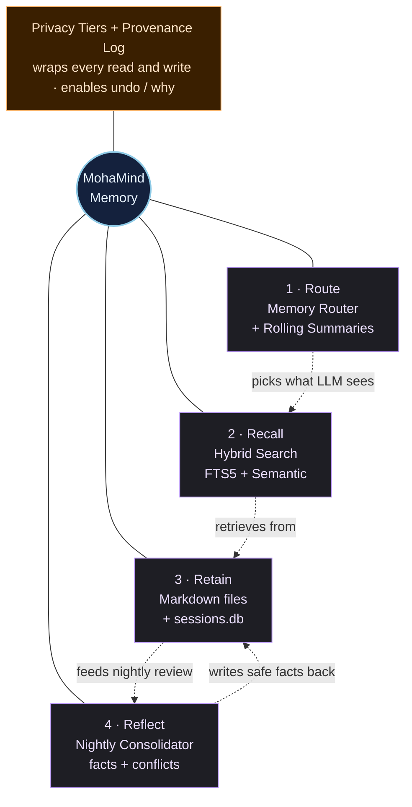
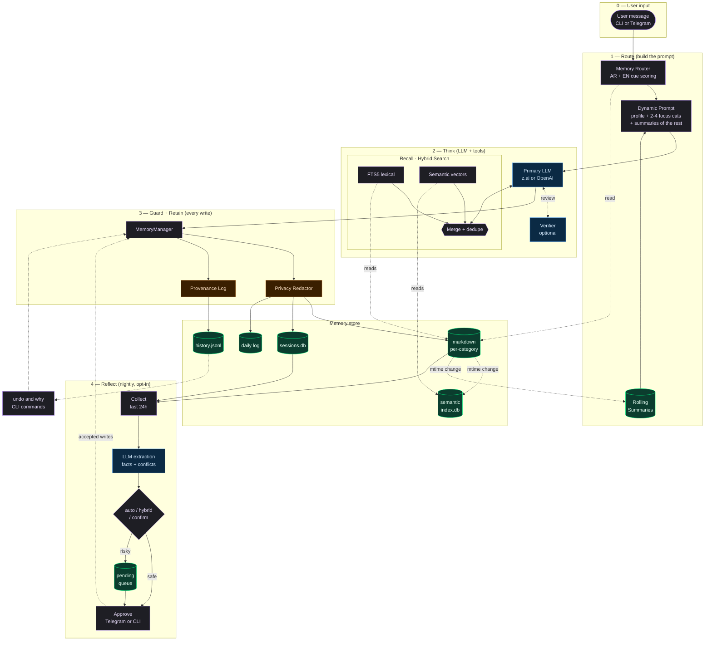
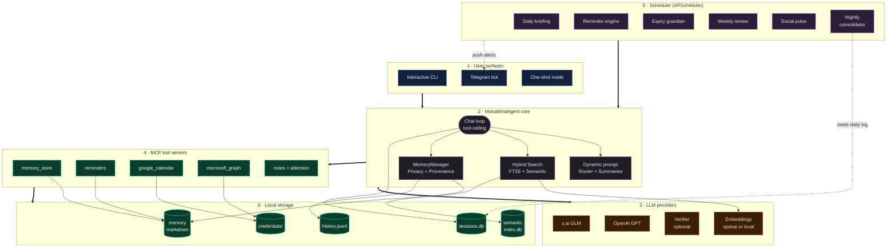

<p align="center">
  
</p>

[](https://github.com/MohamedMohana/MohaMind/actions/workflows/ci.yml)
[](https://www.python.org/downloads/)
[](LICENSE)

MohaMind is a CLI-first personal AI agent built for real life operations — reminders, tasks, family events, bills, documents, health, vehicle, and follow-up. Speaks Arabic and English. Lives in the terminal. Reaches you on Telegram.

**Built for people who want:**

- A terminal-first workflow with slash commands and autocomplete
- Readable Markdown memory files — not opaque databases
- Reliable reminders scheduled in KSA time (Asia/Riyadh)
- Arabic and English conversation, including Gulf/Saudi dialect
- Telegram access alongside the local CLI
- WhatsApp Message Yourself access through optional QR linking
- Optional local Arabic/English speech-to-text for Telegram voice notes and audio files
- Proactive daily briefings, weekly reviews, and expiry alerts

MohaMind uses z.ai (GLM) by default and can use OpenAI as:

- a silent **fallback** (only called when z.ai fails),
- a **verifier** that double-checks every z.ai answer, or
- nothing at all (**solo** mode).

You pick the mode during `mohamind setup` and can change it later.

**Try it before adding an API key:** clone the repo, run `uv sync`, then
`uv run mohamind demo`. You'll get a working focus plan built from fictional
tasks and reminders, entirely on your machine.

## Contents

- [What It Does](#what-it-does)
- [Core Capabilities](#core-capabilities)
- [Quick Start](#quick-start)
- [Run Modes](#run-modes)
- [First 5 Minutes](#first-5-minutes)
- [Focus Sessions](#focus-sessions)
- [Common Real-Life Flows](#common-real-life-flows)
- [How The Agent Thinks About Your Data](#how-the-agent-thinks-about-your-data)
- [Arabic And Dialect Support](#arabic-and-dialect-support)
- [Reliability Notes](#reliability-notes)
- [Core CLI Commands](#core-cli-commands)
- [Telegram Usage](#telegram-usage)
- [WhatsApp](#whatsapp)
- [Voice Input (STT Only)](#voice-input-stt-only)
- [Scheduler And Proactive Behavior](#scheduler-and-proactive-behavior)
- [Memory Model](#memory-model)
- [Advanced Memory Features](#advanced-memory-features)
- [Memory Architecture](#memory-architecture)
- [Integrations](#integrations)
- [Minimal Configuration](#minimal-configuration)
- [System Architecture](#system-architecture)
- [Repository Layout](#repository-layout)
- [Troubleshooting](#troubleshooting)
- [Quality](#quality)
- [Development](#development)
- [License](#license)

## What It Does

MohaMind combines four layers into one personal agent:

- `Conversation`: interactive CLI and Telegram chat
- `Structured memory`: persistent Markdown files under `memory/`
- `Session recall`: persistent conversation history in `memory/sessions.db`
- `Proactive jobs`: scheduled checks for reminders, expiries, briefings, and reviews

In practice, that means you can talk to it normally, let it store what matters, and ask it later what is due, what is expiring, or what was discussed before.

## Core Capabilities

- Energy-aware focus sessions with ranked tasks, suggested work blocks, breaks, and upcoming reminders
- Offline demo and local focus planning with no API key or AI usage charges
- Natural-language reminders with exact KSA scheduling
- Task tracking with priority and due dates
- Occasion tracking for birthdays, anniversaries, and recurring annual dates
- Finance tracking for bills and subscriptions
- Vehicle, health, family, and document tracking
- Persistent conversation recall across restarts
- Attention radar for prioritizing what matters now
- Daily briefing and weekly review
- Arabic and English responses
- Colloquial Arabic understanding, including phrases like:
  - `بكره`
  - `بعد بكره`
  - `٤ العصر`
  - `٥ الصبح`
  - `يوم نعم ويوم لا`

## Quick Start

### Requirements

- Python 3.12+
- [uv](https://docs.astral.sh/uv/)
- one API key:
  - [z.ai](https://z.ai)
  - [OpenAI](https://platform.openai.com/)

You do not need Telegram, Google Calendar, or Outlook to get started.

### Install

```bash
git clone https://github.com/MohamedMohana/MohaMind.git
cd MohaMind
uv sync
```

### Try the offline demo

```bash
uv run mohamind demo
uv run mohamind demo --minutes 30 --energy low
```

The demo creates fictional data in a temporary directory and removes it on exit.
It does not read your personal memory, connect to integrations, or call an LLM.

### Configure

```bash
uv run mohamind setup --quick
```

Quick setup asks for one provider, its API key, your timezone, and your preferred
language. It preserves existing configuration and uses one provider for a new
installation. API key entry is hidden. Setup checks the timezone and rejects example
keys, but does not contact your provider to verify credentials.

Then check local configuration:

```bash
uv run mohamind doctor
```

For optional integrations and advanced settings, run `uv run mohamind setup`.
The full wizard writes `.env` and asks for:

- your LLM provider + API key
- verifier / fallback / solo strategy
- your timezone and morning briefing time
- optional Telegram settings
- optional Google Calendar / Microsoft Graph credentials
- **memory options** — router, rolling summaries, semantic search backend,
  the nightly consolidator (and its mode + time), and which categories are
  sensitive

There is no need to hand-edit `.env` or `echo ... >> .env` to turn these on —
re-run `uv run mohamind setup` any time to change them.

If you skip setup and run `uv run mohamind` interactively without an API key,
MohaMind runs quick setup and uses the saved settings immediately. Noninteractive
runs report the setup command and exit instead of waiting for input.

### Run

```bash
uv run mohamind
```

Other useful entry points:

```bash
uv run mohamind "Plan my week"
uv run mohamind -p "What needs my attention today?"
uv run mohamind --help
uv run mohamind doctor
uv run mohamind --bot
uv run mohamind --all
```

## Run Modes

MohaMind supports these main run modes:

- `uv run mohamind`
  Opens the interactive CLI.

- `uv run mohamind --bot`
  Runs Telegram only.

- `uv run mohamind --all`
  Runs the CLI and Telegram together.

- `uv run mohamind -p "..."`  
  One-shot mode for shell usage and quick queries.

Important:

- the CLI is your main control surface
- Telegram is the main push-notification surface
- scheduled reminders and proactive alerts are most useful when `--bot` or `--all` is running

## First 5 Minutes

Follow [the first-run walkthrough](docs/getting-started.md) to create a task,
save a reminder, and check that it survives a restart. Reminder dates currently use
Asia/Riyadh; setting a different schedule timezone does not yet convert every
reminder flow. Scheduled delivery requires a running messaging service.

Start the CLI:

```bash
uv run mohamind
```

Then try these commands:

```text
/majlis
/today
/add task renew passport
/remind remind me tomorrow at 9 am to call Ahmad
/recall passport
/search passport
/memory
```

You can also just talk naturally:

```text
Tomorrow at 9 AM remind me to call Ahmad.
My son's birthday is on 2026-06-20. Save it and remind me before it.
What needs my attention this week?
```

And in Arabic:

```text
ذكرني بكره ٥ الصبح عندي رحلة
عندي موعد بالمستشفى ٤ العصر بعد يومين
أبي أروح النادي يوم نعم ويوم لا الساعة ٤ العصر
موعد زواجي ١-١-٢٠٢٦
```

When you reopen the CLI, MohaMind reloads recent conversation history for that chat and shows a compact recap if past messages exist.

## Focus Sessions

Turn your saved tasks into a manageable next step:

```text
/focus
/focus 30 low
/focus 90 high
```

`/focus` uses your most recently recorded energy level unless you specify one.
Overdue tasks come first, followed by tasks due today, tomorrow, high-priority
work, other dated tasks, and the undated backlog. The plan explains why each task
was selected and shows overdue reminders plus those in the next 24 hours.

| Energy | Suggested work block | Maximum tasks per session |
| --- | --- | --- |
| Low | 15 minutes | 1 |
| Neutral | 25 minutes | 3 |
| High | 45 minutes | 5 |

Five-minute breaks between tasks count toward your budget. Blocks shrink to fit
the available time; these are work suggestions, not estimates of how long a task
will take. The planner does not check calendar availability, book time, or mark
tasks complete. Use `/done <task text>` when finished and generate a fresh plan.
Dates and reminder times use Asia/Riyadh.

You can also run the planner without an API key or an interactive session:

```bash
uv run mohamind focus --minutes 60 --energy neutral
uv run mohamind focus --minutes 30 --energy low --json
```

The standalone command defaults to neutral energy and reads your configured
`MEMORY_DIR`. Its JSON output includes work blocks, ranking reasons, reminder
times, and counts for active, overdue, and remaining tasks. Budgets must be
between 5 and 480 minutes. Local planning requires no LLM call; asking for a plan
through ordinary CLI or Telegram chat uses the agent's normal AI provider.

## Common Real-Life Flows

These are typical examples of how the agent handles everyday personal operations.

| You say | What MohaMind does |
| --- | --- |
| `ذكرني بكره الساعة ٧ عندي اجتماع` | Creates a timed reminder in `memory/reminders.md` for tomorrow at 7 in your configured timezone |
| `عندي موعد بالمستشفى بعد يومين الساعة ٤ العصر` | Interprets the colloquial date and time, then stores it as a reminder or appointment context |
| `بعد بكره لازم أشتري الدوا` | Treats it as a due task or reminder depending on wording and available date context |
| `موعد زواجي ١-١-٢٠٢٦` | Stores it as an occasion in `memory/occasions.md` and makes it available for yearly reminders |
| `بعد شهر عندي صيانة سيارة` | Stores the service timing as a reminder or task, and related vehicle details can live in `memory/vehicle.md` |
| `عندي تجديد OpenAI بتاريخ 2026-05-14` | Stores the subscription fact in finance memory and can create a reminder for the renewal date |
| `أبي أروح النادي يوم نعم ويوم لا الساعة ٤ العصر` | Interprets the recurrence as every two days and schedules it accordingly |

The most reliable pattern is simple:

- use reminder phrasing for anything that needs a timed alert
- use task phrasing for things that need tracking and completion
- use occasion phrasing for annual dates such as birthdays and anniversaries

## How The Agent Thinks About Your Data

For reliable behavior, MohaMind separates user input into different buckets.

### 1. Reminders

Use reminders when you need an alert at a specific time.

Examples:

- `ذكرني بكره ٧ الصبح عندي اجتماع`
- `Remind me in two days about the hospital appointment at 4 PM`
- `ذكرني كل يومين أروح النادي الساعة ٤ العصر`

Stored in:

- `memory/reminders.md`

Executed by:

- the reminder engine, which runs every 30 minutes when the scheduler is active

### 2. Tasks

Use tasks when something needs doing, even if it is not tied to an exact alert time.

Examples:

- `Add task renew car insurance`
- `أضف مهمة شراء الدواء بعد بكره`

Stored in:

- `memory/tasks.md`

Used by:

- the CLI task views
- the attention radar
- reminder logic for due tasks

### 3. Occasions

Use occasions for annual or meaningful dates such as birthdays and anniversaries.

Examples:

- `موعد زواجي ١-١-٢٠٢٦`
- `Add Sara's birthday on 2026-08-18`

Stored in:

- `memory/occasions.md`

Used by:

- the occasion parser
- the reminder engine
- the attention radar

### 4. Long-Term Trackers

Use the domain trackers for facts and ongoing records:

- `family.md`
- `vehicle.md`
- `finances.md`
- `health.md`
- `documents.md`
- `relationships.md`

Examples:

- hospital appointments and family appointments
- vehicle service history and next service
- OpenAI subscription renewal
- medications and doctors
- passports and expiring documents

## Arabic And Dialect Support

MohaMind is fully bilingual:

- **Free-form chat** always mirrors the language you write in — Arabic in, Arabic out; English in, English out.
- **Proactive messages** (morning briefings, reminder pushes, expiry alerts, weekly reviews, integrity reports) follow `AGENT_LANGUAGE` — `ar` (default) or `en`, chosen during `mohamind setup`.

All the strings live in one catalog ([moha_mind/utils/i18n.py](./moha_mind/utils/i18n.py)), so adding another language is a single-file contribution.

MohaMind does not require formal Arabic.

It is designed to handle normal, spoken Arabic and Saudi/Gulf phrasing. The current normalization layer helps the agent interpret:

- Arabic digits like `١٤` and `٧`
- `بكره` as tomorrow
- `بعد بكره` as the day after tomorrow
- `٤ العصر` as `16:00`
- `٥ الصبح` as `05:00`
- `يوم نعم ويوم لا` as every two days

This means inputs like the following are valid:

```text
ذكرني بكره ٥ الصبح
عندي موعد بالمستشفى ٤ العصر
بعد بكره لازم أشتري الدوا
أبي أروح النادي يوم نعم ويوم لا
```

One important rule still applies:

- if you say only `الساعة ٤` without `الصبح`, `العصر`, or `المساء`, that is naturally ambiguous

For maximum reliability, specify the time period when it matters.

## Reliability Notes

MohaMind is designed to behave predictably, but reliable automation still depends on clear user intent.

- `Reminder` is the best path for anything that must trigger at a specific time.
- `Task` is the best path for something you need to track and complete.
- `Occasion` is the best path for birthdays, anniversaries, and yearly dates.
- If you want proactive alerts, keep `uv run mohamind --bot` or `uv run mohamind --all` running.
- If a time expression is ambiguous, the agent may ask for clarification or choose the safest interpretation.
- Structured Markdown memory is the source of truth for durable facts; session recall helps with conversational context.

Tool execution limits can be adjusted in `.env`:

| Setting | Default | Purpose |
| --- | --- | --- |
| `AGENT_MAX_TOOL_ROUNDS` | `10` | Maximum tool-request rounds in one chat turn |
| `AGENT_MAX_TOOL_CALLS` | `40` | Maximum tool-call attempts per chat turn, briefing, or weekly review |
| `AGENT_TOOL_TIMEOUT_SECONDS` | `60` | Timeout for each asynchronous tool execution |
| `AGENT_MAX_TOOL_RESULT_CHARS` | `16000` | Maximum characters returned from each tool to the model |

Invalid JSON and non-object arguments are rejected before execution. Calls above the
budget receive an explicit skipped result, and chat requests a final summary without
tools. Briefings and weekly reviews allow one bounded tool batch before their final
response. Long tool results are marked as truncated; stored source data is unchanged.

Timeouts request cancellation of cooperative async handlers. They cannot interrupt
blocking synchronous code or undo an action already accepted by an external service.
A timeout reports an unknown outcome so the agent can check state before retrying.
Built-in hybrid and semantic memory searches run in a dedicated daemon thread, so embedding
requests and local inference do not block the event loop or its timeout. A search
already running may finish after its caller times out; subsequent searches on the
same agent wait for it, with that wait counting toward their own timeout.
The worker is separate from asyncio's default executor, so a stuck embedding call
does not hold up one-shot CLI shutdown or process exit. At most one search worker
runs per agent; a permanently stuck worker requires restarting that agent to restore
semantic search. Workers read source memory and update only the derived SQLite index;
SQLite rolls back an unfinished index transaction if the process exits.
These limits do not cap total tokens, API spending, or whole-turn duration.

## Core CLI Commands

| Command | What it does |
| --- | --- |
| `/help` | Show available commands |
| `/majlis` | Open the command center |
| `/today` | Show today's overview |
| `/focus [minutes] [low\|neutral\|high]` | Build an energy-aware focus session from saved tasks |
| `/radar` | Show ranked attention items |
| `/tasks` | List active tasks |
| `/reminders` | Show scheduled reminders |
| `/remind <text>` | Create a reminder from natural language |
| `/add task <text>` | Add a task quickly |
| `/done <text>` | Complete a task |
| `/search <query>` | Search structured memory |
| `/recall <query>` | Search memory and past conversations |
| `/memory` | Preview memory files |
| `/mcp` | Show external MCP servers and their tools |
| `/logs [n]` | Show the last n log lines (default 20) |
| `/expiring` | Show expiring documents and renewals |
| `/briefing` | Generate the daily briefing |
| `/review` | Generate the weekly review |
| `/calendar` | Show calendar snapshot |
| `/family` | Show family overview |
| `/social` | Show social connections and neglected contacts |
| `/vehicle` | Show vehicle info and next service |
| `/health` | Show medications and health status |
| `/finance` | Show finance overview |
| `/stats` | Show system stats |
| `/config` | Show current configuration |
| `/doctor` | Check configuration health |
| `/setup` | Re-run setup wizard |
| `/provider <name>` | Switch LLM provider |
| `/model <name>` | Change model name |
| `/key` | Update the current provider API key |
| `/undo` | Revert the last memory mutation |
| `/why <cat> <text>` | Show provenance for a memory line |
| `/consolidate` | Run the memory consolidator now |
| `/pending` | List consolidator proposals awaiting approval |
| `/memory_doctor` | Report memory size, summaries, semantic index status |
| `/reindex` | Rebuild the semantic memory index |
| `/refresh_summaries` | Regenerate rolling category summaries |
| `/quit` | Exit the CLI |

## Telegram Usage

Telegram is optional, but it is the best surface for receiving reminders and proactive messages.

Set these values in `.env`:

- `TELEGRAM_BOT_TOKEN`
- `TELEGRAM_CHAT_ID`

Then run:

```bash
uv run mohamind --bot
```

Or:

```bash
uv run mohamind --all
```

Telegram supports commands and free-form chat. You do not need to talk like a command interface all the time.

### Owner lock (who can talk to the bot)

Telegram bots are publicly discoverable, but MohaMind's memory is personal. The bot therefore only answers the IDs you allow:

- `TELEGRAM_CHAT_ID` — your own chat (also where proactive alerts go)
- `TELEGRAM_ALLOWED_USER_IDS` — optional comma-separated extra user IDs (e.g. a spouse)

Only private chats with an allowed sender can reach the agent. Groups, supergroups,
channels, and anonymous senders are blocked, including when the owner sends the
message. Proactive messages also require a private chat. Refusals are logged without
user or chat IDs. With no allowed IDs configured, a private message shows the ID to
paste into `.env`.

**One installation is one personal agent.** Extra allowed users share its durable
memory and tools; this is not a service with isolated accounts. Each person should
run their own instance with their own bot, credentials, and memory directory.

### Telegram commands

| Command | What it does |
| --- | --- |
| `/help` | Full command list in Arabic |
| `/status` | Current LLM, strategy, task/expiry count |
| `/today`, `/tomorrow`, `/week` | Schedule overviews |
| `/tasks`, `/add <text>`, `/done [n]`, `/untask <n>` | Task management |
| `/remind <text>`, `/reminders [days]` | Timed reminders |
| `/memory` | List memory categories with line counts |
| `/show <category>` | Dump one memory file |
| `/remember <text>`, `/recall <query>` | Save / search memory |
| `/forget <query>` or `/forget <category> <query>` | Delete matching lines (inline confirm) |
| `/notes`, `/note <title>: <content>`, `/read_note <title>`, `/delete_note <title>` | Notes |
| `/calendar`, `/briefing`, `/review`, `/radar` | Views generated by the agent |
| `/health`, `/family`, `/social`, `/car`, `/pay`, `/expiry [days]`, `/shopping` | Domain summaries |

Destructive commands (`/forget`, `/untask`, `/delete_note`) always ask for inline-keyboard confirmation before anything is removed from disk. Set `TELEGRAM_ALLOW_DESTRUCTIVE=false` in `.env` to disable them entirely.

## WhatsApp

Link your existing WhatsApp account with a QR code and talk to MohaMind through
**Message Yourself**, using your current memory:

```bash
uv run mohamind whatsapp setup
uv run mohamind whatsapp
```

Requires Node.js 20+ and npm. This is an optional, unofficial WhatsApp Web bridge;
read [the WhatsApp guide](docs/whatsapp.md) for pairing, supported messages, and
scheduled notifications. Linking does not replace or reset your memory.

## Voice Input (STT Only)

MohaMind can transcribe Telegram voice notes and audio uploads locally with
[faster-whisper](https://github.com/SYSTRAN/faster-whisper), an open-source Whisper
implementation. This is **speech-to-text only**; replies remain text.

```bash
uv sync --extra voice
```

Set these values in your local `.env`, then restart the bot:

```dotenv
VOICE_ENABLED=true
VOICE_MODEL=small
VOICE_DEVICE=cpu
VOICE_COMPUTE_TYPE=int8
VOICE_LANGUAGE=auto
```

Send a recording in your private bot chat. Review the transcript and tap **Send to
agent**, or cancel and type a correction. Confirmation expires after five minutes;
a new recording replaces your previous pending transcript. Nothing is sent to the
agent or executed until you confirm. The confirmation messages follow `AGENT_LANGUAGE`.

`auto` detects the spoken language; `ar` or `en` forces it. Use a multilingual
model, such as `small`, `medium`, or `large-v3`. English-only `.en` models are
rejected. Larger models need more memory and time; recognition quality varies
with dialect, noise, and mixed-language speech, so review the transcript.
For a suitable NVIDIA GPU, set `VOICE_DEVICE=cuda` and `VOICE_COMPUTE_TYPE=float16`;
see faster-whisper's documentation for CUDA requirements.

The default limits are 10 MiB and five minutes per recording. Configure them with
`VOICE_MAX_FILE_MB` and `VOICE_MAX_DURATION_SECONDS`. Decoded duration is checked
as well as Telegram metadata. Inference runs outside the event loop, with one
cached model and serialized requests. `VOICE_CPU_THREADS` defaults to 4.

**Privacy:** Telegram receives the recording as part of its messaging service.
MohaMind downloads it into RAM and transcribes it on your machine, without saving
an audio file or sending audio to a transcription API. A transcript preview is
returned through Telegram. After confirmation, text goes to your configured LLM
and follows normal memory/session behavior. Cancelling does not erase Telegram's
copy of the recording or preview. The first transcription downloads model weights
from Hugging Face; set `VOICE_LOCAL_FILES_ONLY=true` after caching them (or point
`VOICE_MODEL` to a local model directory) to prevent model downloads.

Run voice tests with `uv run --extra voice pytest -q`. Normal installation and
text chat do not require Whisper. Keep `--extra voice` when syncing a voice-enabled
installation; plain `uv sync` removes optional packages.

## Scheduler And Proactive Behavior

When the scheduler is active, MohaMind runs recurring background jobs for:

- daily morning briefing
- reminder checks every 30 minutes
- expiry monitoring
- weekly review
- social pulse
- pregnancy update checks
- monthly subscription review

This behavior is configured in [moha_mind/scheduler/jobs.py](./moha_mind/scheduler/jobs.py).

## Memory Model

MohaMind keeps memory understandable on purpose.

### Structured Long-Term Memory

Main files under `memory/`:

- `profile.md`
- `family.md`
- `tasks.md`
- `reminders.md`
- `occasions.md`
- `vehicle.md`
- `finances.md`
- `health.md`
- `home.md`
- `documents.md`
- `travel.md`
- `learning.md`
- `shopping.md`
- `relationships.md`
- `energy_log.md`

Additional files:

- `memory/daily_log/YYYY-MM-DD.md`
- `memory/notes/*.md`

### Persistent Session Recall

Conversation history is stored separately in:

- `memory/sessions.db`

This gives the agent two memory layers:

- curated long-term memory for durable facts
- persistent session history for conversational recall

### Privacy And Ownership

MohaMind is designed so your important memory stays understandable and inspectable.

- structured memory is stored as local Markdown files
- session recall is stored locally in `memory/sessions.db`
- you can inspect, back up, or delete these files directly
- the project does not depend on a hosted proprietary memory layer

### How Recall Works

- `/search` looks through the structured Markdown files
- `/recall` looks through both structured memory and past conversations
- normal chat can also pull relevant conversation context automatically

## Advanced Memory Features

MohaMind ships a four-layer memory upgrade stack on top of the flat Markdown
files. Everything here is configured interactively the first time you run
`uv run mohamind setup` — you do not need to hand-edit `.env`.

### 1. Memory Router + Rolling Summaries — *on by default*

The system prompt no longer dumps every memory category on every turn.
Instead, a router scores your message against bilingual (Arabic + English)
cues for each category, picks the 2-4 most relevant ones to inject **in full**,
and swaps every other category for a **one-paragraph summary** that is
regenerated only when the source file's modification time changes.

Effect: the prompt stays small and roughly constant in size as your memory
grows from 10 lines to 10,000.

Wizard keys: `MEMORY_ROUTER_ENABLED`, `MEMORY_SUMMARIES_ENABLED`.

### 2. Hybrid Semantic Search — *opt-in*

On top of the existing FTS5 lexical search, MohaMind can add concept-level
recall using vector embeddings. Turn it on during setup and pick a backend:

- `openai` — reuses your `OPENAI_API_KEY` with `text-embedding-3-small`.
- `local` — uses `sentence-transformers` offline. Install the extra once:
  `uv sync --extra embeddings`.

The agent gets a new `semantic_search_memory` tool, and the existing
`search_memory` tool becomes hybrid (lexical ∪ semantic). The index is
SQLite-backed at `memory/.semantic_index.db` and re-indexes incrementally on
file mtime changes. Rebuild from scratch with `/reindex`.

Wizard keys: `EMBEDDING_BACKEND`, `EMBEDDING_MODEL`.

### 3. Nightly Memory Consolidator — *opt-in*

Each night at a time you pick, the consolidator reviews the last 24h of daily
logs and chat messages, asks the primary LLM to extract `new_facts`,
`observations`, and `conflicts`, and then routes each proposal according to
your chosen mode:

| Mode | Behavior |
| --- | --- |
| `auto` | Apply every proposal silently. |
| `confirm` | Queue every proposal for you to accept/reject. |
| `hybrid` *(recommended)* | Auto-apply safe additions, queue conflicts and sensitive-category writes for approval. |

Pending proposals show up with `/pending` in the CLI, and in Telegram they
arrive as inline-keyboard cards with Accept/Reject buttons. A morning digest
is posted to Telegram the next day.

Wizard keys: `CONSOLIDATOR_ENABLED`, `CONSOLIDATOR_MODE`, `CONSOLIDATOR_TIME`,
`CONSOLIDATOR_SEND_DIGEST`.

### 4. Provenance + Undo — *always on*

Every memory mutation (write, append, delete, consolidate) appends a
`MemoryEvent` to `memory/.history.jsonl` with a content hash, a short
snippet, and the source (`user`, `agent`, `consolidator`, `undo`).

- `/undo` reverts the last memory change across any category.
- `/why <category> <fragment>` shows the audit trail for a specific line.
- `/memory_doctor` prints category sizes, summary freshness, and semantic
  index status.

### Privacy Tiers — *cross-cutting*

Sensitive categories — by default `finances`, `health`, `documents` — are
treated as tier-1:

- **never** indexed for semantic search (defense-in-depth even if you enable
  embeddings),
- **redacted** before being stored in `memory/sessions.db` (amounts, emails,
  phone numbers, long digits),
- **redacted** before the verifier LLM sees your messages,
- **redacted** before being mirrored into the daily log.

Configure the list with `SENSITIVE_CATEGORIES` during setup.

## Memory Architecture

The memory subsystem is built around four concentric ideas — **Route**,
**Recall**, **Retain**, **Reflect** — wrapped by a **Privacy / Provenance**
guard that every write crosses.

### Concept map



### Data flow — one turn + the nightly loop

The diagram below is laid out in clear top-to-bottom phases so you can trace
a message all the way from the user, through the LLM, into durable storage,
and eventually back out through the nightly consolidator.



**How to read the diagram:**

- Phase 1 — **Route** keeps prompt size flat as memory grows. Only profile and
  the top-scoring categories go in full; everything else is a one-paragraph
  summary.
- Phase 2 — **Think** is where the LLM calls the `search_memory` tool. Lexical
  FTS5 and semantic vectors are merged into a single ranked list before being
  returned to the model.
- Phase 3 — **Guard + Retain** is the outbound choke point. No write reaches
  disk without passing the Privacy Redactor and appending to the Provenance
  Log — which is what makes `/undo` and `/why` possible.
- Phase 4 — **Reflect** runs once per day (opt-in). It distills durable facts
  from yesterday's activity and, in `hybrid` mode, auto-applies safe additions
  while queueing anything sensitive or conflicting for your approval.

## Integrations

### LLM Providers

- `z.ai` is the default primary provider.
- `OpenAI` is supported as primary or as the secondary brain.

### Secondary-Brain Strategy

The `LLM_STRATEGY` env variable controls how the secondary provider is used:

| Strategy | Behavior |
| --- | --- |
| `solo` | Only the primary LLM is ever called. No second brain. |
| `fallback` | The secondary is called only if the primary API call fails. |
| `verify` | After every reply, the secondary grades the primary's answer. If it flags real issues, the primary is re-prompted once with the critique, then the corrected answer is returned to the user. |

Tune `verify` mode with:

- `VERIFIER_STRICTNESS` — `lenient`, `balanced`, or `strict`.
- `VERIFIER_MAX_RETRIES` — how many revision rounds are allowed (default `1`).

All three strategies are first-class options in the setup wizard.

### Google Calendar

1. Create Google Calendar OAuth credentials.
2. Put the file at `credentials/google_credentials.json`, or update `GOOGLE_CREDENTIALS_PATH`.
3. Keep `GOOGLE_TOKEN_PATH` pointed at a writable token file.

### Microsoft Outlook / Graph

Set these values in `.env`:

- `MS_CLIENT_ID`
- `MS_CLIENT_SECRET`
- `MS_TENANT_ID`
- `MS_TOKEN_PATH`

### External MCP Servers

MohaMind speaks the real Model Context Protocol, so you can plug in any
third-party MCP server (web fetch, GitHub, filesystem, Notion, ...) and the
agent gets its tools automatically.

1. Copy `mcp_servers.example.json` to `mcp_servers.json` (git-ignored).
2. Declare servers in the same format Claude uses:

   ```json
   {
     "mcpServers": {
       "fetch": { "command": "uvx", "args": ["mcp-server-fetch"] },
       "github": {
         "command": "npx",
         "args": ["-y", "@modelcontextprotocol/server-github"],
         "env": { "GITHUB_PERSONAL_ACCESS_TOKEN": "${GITHUB_TOKEN}" }
       },
       "context7": { "url": "https://mcp.context7.com/mcp" }
     }
   }
   ```

3. Restart MohaMind. Check connections and discovered tools with `/mcp`.

Notes:

- `command`/`args` servers run over stdio; `url` servers use streamable HTTP.
- `${VAR}` in `env` values and `headers` is expanded from your environment,
  so secrets stay in `.env` or your shell.
- Tools are exposed to the agent as `<server>_<tool>` (e.g. `github_create_issue`).
- A server that fails to start is logged and skipped — MohaMind still boots.
- Set `"disabled": true` to keep a server configured but off, and
  `MCP_SERVERS_CONFIG` in `.env` to move the config file elsewhere.

## Minimal Configuration

Most users only need these values:

| Variable | Required | Purpose |
| --- | --- | --- |
| `PRIMARY_LLM` | yes | `zai` or `openai` |
| `LLM_STRATEGY` | no | `solo`, `fallback` (default), or `verify` |
| `SECONDARY_LLM` | no | `zai`, `openai`, or `none` |
| `VERIFIER_STRICTNESS` | no | `lenient`, `balanced` (default), `strict` |
| `VERIFIER_MAX_RETRIES` | no | how many times to revise (default `1`) |
| `ZAI_API_KEY` | if using z.ai | z.ai API key |
| `OPENAI_API_KEY` | if using OpenAI | OpenAI API key |
| `TIMEZONE` | yes | your local timezone |
| `AGENT_LANGUAGE` | no | `ar` (default) or `en` — language of briefings, reminders, and alerts |
| `MORNING_BRIEFING_TIME` | no | daily briefing time |
| `WEEKLY_REVIEW_DAY` | no | weekly review day |
| `WEEKLY_REVIEW_TIME` | no | weekly review time |
| `MEMORY_DIR` | no | defaults to `./memory` |
| `TELEGRAM_ALLOWED_USER_IDS` | no | extra Telegram user IDs (comma-separated) allowed to talk to the bot |
| `TELEGRAM_ALLOW_DESTRUCTIVE` | no | set to `false` to lock down `/forget`, `/untask`, `/delete_note` |
| `RELIABILITY_GUARDIAN_ENABLED` | no | daily memory integrity scan and local backups |
| `RELIABILITY_GUARDIAN_TIME` | no | when to run the reliability scan |
| `MEMORY_BACKUP_RETENTION_DAYS` | no | how long to keep local memory backups |

Use `.env.example` as the full reference.

## System Architecture

Zooming out from the memory subsystem, the full agent looks like this:



**The three loops you should remember:**

1. **Chat loop** — CLI/Telegram message → dynamic prompt → LLM (± verifier) →
   tool calls (memory, reminders, calendar) → reply.
2. **Scheduler loop** — APScheduler fires jobs (briefing, reminders,
   expiry, weekly review, consolidator) that read memory and push to Telegram.
3. **Memory loop** — every write is redacted, persisted to Markdown, and
   logged for `/undo` + `/why`. The nightly consolidator promotes new facts
   from daily log + sessions into durable memory.

## Repository Layout

```text
MohaMind/
├── moha_mind/
│   ├── agent/                core agent + memory subsystem
│   │   ├── core.py              chat loop, tool routing, hybrid search
│   │   ├── memory.py            MemoryManager (reads/writes .md files)
│   │   ├── memory_router.py     scores & picks focus categories
│   │   ├── memory_summarizer.py one-paragraph summaries per category
│   │   ├── semantic_index.py    SQLite vector store
│   │   ├── embeddings.py        OpenAI + local backends
│   │   ├── privacy.py           redactors for sensitive tiers
│   │   ├── provenance.py        append-only audit log (.history.jsonl)
│   │   ├── session_store.py     sessions.db (conversation recall)
│   │   ├── verifier.py          secondary-brain review strategy
│   │   └── system_prompt.py     dynamic prompt builder
│   ├── cli/                  interactive terminal app + setup wizard
│   ├── mcp_servers/          memory_store, reminders, google_calendar,
│   │                         microsoft_graph, ...
│   ├── scheduler/            daily briefing, reminders, weekly review,
│   │                         expiry guardian, social pulse,
│   │                         memory_consolidator
│   ├── telegram_bot/         handlers, formatters, inline-keyboard flows
│   └── utils/                timezone, Arabic normalization, schedules
├── memory/                   Markdown memory + sessions.db + audit log
├── credentials/              optional Google / Microsoft OAuth
└── tests/                    tests covering agent, memory, scheduler, CLI
```

## Troubleshooting

- Run `uv run mohamind doctor` to check `.env`, API keys, memory, and credentials directories.
- Logs live in the project at `logs/mohamind.log` (gitignored, rotated, timestamps in your
  `TIMEZONE`; move them with `LOG_DIR` in `.env`). The interactive CLI keeps the terminal
  clean and logs only to the file — use `/logs [n]` to see recent lines. `mohamind --bot`
  also logs to the console so systemd/docker capture it.
- If you only want the CLI, leave Telegram blank.
- If calendars are not configured, the app still runs. Calendar commands simply show those integrations as unavailable.
- If you want to reset session history, remove `memory/sessions.db`.
- If you want to inspect the durable memory, open the Markdown files under `memory/`.

## Quality

Verification commands:

- `uv run pytest -q`
- `uv run ruff check .` -> clean

## Development

See [CONTRIBUTING.md](CONTRIBUTING.md) for development setup, pull requests, and
guidance on keeping personal data out of contributions.
See [ROADMAP.md](ROADMAP.md) for prioritized improvements and release acceptance criteria.

Install dependencies:

```bash
uv sync
```

Run tests:

```bash
uv run pytest
```

Lint and format:

```bash
uv run ruff check .
uv run ruff format .
```

Key directories:

- `moha_mind/agent/` - core agent loop, memory, recall, prompting
- `moha_mind/cli/` - interactive CLI
- `moha_mind/mcp_servers/` - task, reminder, family, finance, memory, and calendar tools
- `moha_mind/scheduler/` - briefings, reminders, expiry checks, review jobs
- `moha_mind/telegram_bot/` - Telegram interface
- `memory/` - persistent user data
- `tests/` - automated tests

## License

MIT. See [LICENSE](LICENSE).
